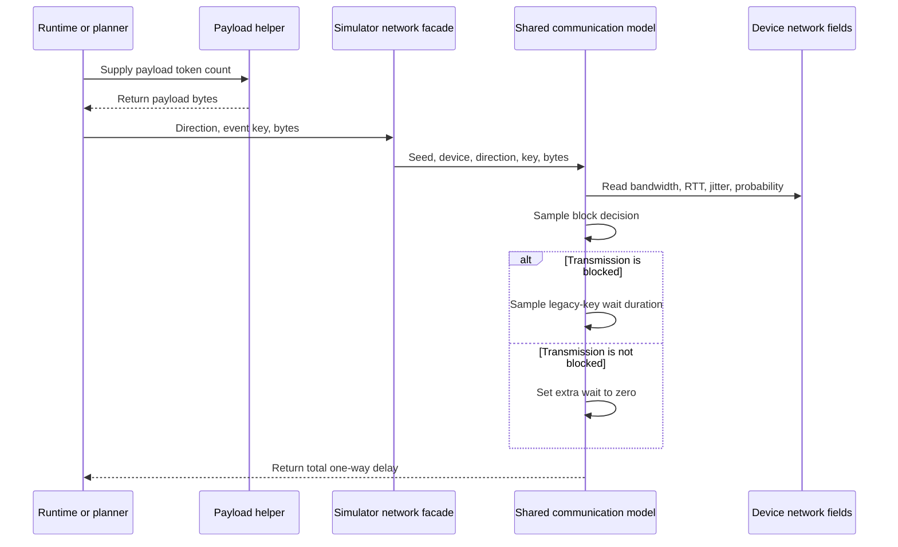

# Probabilistic Network Blocking Design

## Scope

Replace the current always-on deterministic network jitter with a shared,
deterministic model of probabilistic short blocking. Uplink and downlink
bandwidth and RTT remain fixed. For each modeled transmission, the simulator
first makes a deterministic Bernoulli decision. An unblocked transmission adds
no jitter; a blocked transmission adds a deterministic wait sampled from the
device's existing `jitter_ms` interval.

The model applies uniformly to every edge/server communication path. Methods
that intentionally have no decode-stage communication, namely `target_only`
and the server-only variants, remain network-free. This design does not change
edge compute, server or target latency, candidate generation, verification,
scheduler policy, batching, gamma selection, or any method's algorithmic
semantics.

This document specifies the design only. It does not change production code,
configuration, tests, generated traces, or provide an implementation plan.

## Current Network Call-Chain Findings

### Authoritative delay calculation

`src/communication.py` is the only production module that calculates network
delay. Its current layers are:

- `dssd_transmission_delay_ms(payload_bytes, rtt_ms, bandwidth_mbps)` validates
  non-negative payload size and positive bandwidth, then returns half RTT plus
  serialization time;
- `deterministic_jitter_ms(seed, device, direction, key)` hashes the string
  `"{seed}:{device_id}:{direction}:{key}"`, converts the first eight SHA-256
  bytes to a ratio in `[0, 1)`, and multiplies it by `device.jitter_ms`;
- `network_delay_ms(...)` selects the device's uplink or downlink bandwidth,
  adds the deterministic jitter unconditionally, and rejects unsupported
  directions.

The current formula is:

```text
base_delay_ms = rtt_ms / 2
              + payload_bytes * 8 / (bandwidth_mbps * 1000)

legacy_jitter_ratio = uint64_be(
    SHA-256("{seed}:{device_id}:{direction}:{key}")[0:8]
) / 2**64

delay_ms = base_delay_ms + legacy_jitter_ratio * jitter_ms
```

This code does not consume `Simulator._rng`, Python's process-randomized
`hash`, or a mutable network RNG. Repeated calls with identical inputs return
the same value regardless of call order.

### Simulator facade and payload construction

Every simulator network calculation reaches the communication module through
`Simulator._network_delay_ms`. The facade supplies `simulation.seed` and
forwards the `Device`, direction, event key, and payload bytes to
`src.communication.network_delay_ms`.

`Simulator._speculative_network_delay_ms` is a token-count convenience wrapper
used by planning and prediction. Both wrappers construct payload bytes through
`Simulator._payload_bytes`:

```text
payload_bytes = network.packet_header_bytes
              + token_count * network.packet_token_bytes
```

The prompt is not included. This is consistent with the decode-only contract:
prefix state is assumed to exist before decode begins.



### Actual transfer keys

The current runtime paths use the following keys for actual communication
events:

| Runtime path | Direction | Event key | Call location |
| --- | --- | --- | --- |
| Async methods, including `full` and ablations | Uplink | `segment.segment_id` | `_on_draft_done` |
| Async methods, including `full` and ablations | Downlink | `segment.segment_id` | `_resolve_verification` |
| `specedge_linear` and `specedge_tree` | Uplink | `segment.segment_id` | `_on_draft_done` |
| `specedge_linear` and `specedge_tree` | Downlink | `segment.segment_id` | `_resolve_verification` |
| `dip_sd` | Uplink | `"dip-sd-up:{epoch_index}:{request_id}"` | `_run_dip_sd` |
| `dip_sd` | Downlink | `"dip-sd-down:{epoch_index}:{request_id}"` | `_run_dip_sd` |

`segment_id` is unique within a simulator. DiP-SD processes a request at most
once in an epoch, so the epoch/request pair identifies that round's transfer.
The direction is also part of every hash input, so reuse of the same segment
identifier for upload and download does not couple their samples.

### Prediction and planning keys

Network estimates also use the same facade and communication function:

| Consumer | Direction | Key |
| --- | --- | --- |
| Adaptive gamma scoring in `_select_gamma` | Uplink | `"estimate-up:{gamma}"` |
| Adaptive gamma scoring in `_select_gamma` | Downlink | `"estimate-down:{gamma}"` |
| SpecEdge pipeline-cycle estimation | Uplink | `"pipeline-up:{device_id}:{gamma}"` |
| SpecEdge pipeline-cycle estimation | Downlink | `"pipeline-down:{device_id}:{gamma}"` |
| DiP-SD optimizer problem construction | Uplink | `"dip-sd-plan:{epoch_index}:{request_id}"` |

These are deterministic estimates, not additional packet events. They must
nevertheless use the same probability and wait semantics because they model
the same configured communication resource. Their existing keys remain
unchanged. This design does not alter when estimates are requested or how an
algorithm consumes their returned delay.

### Device fields and configuration construction

`src/entities.py` defines `Device` as an immutable record. Its current network
fields are `uplink_mbps`, `downlink_mbps`, `rtt_ms`, and `jitter_ms`.

`src/config.py:build_devices` is the sole production construction path. It
reads these fields from each
`device_pools.<pool>.templates.<device_type>` mapping, assigns sequential
`device_id` values, and returns the devices used by one `Simulator`. The
top-level `network` mapping contains only packet encoding sizes; it does not
contain link quality.

`Simulator.__init__` obtains the selected pool from `MethodSpec.device_pool`
and calls `build_devices`. Requests are then assigned to devices round-robin.
Therefore a device-template field is the existing and correct ownership
boundary for a per-link blocking probability.

### Cross-method routing

The canonical and proposed method paths are:

| Method family | Network behavior |
| --- | --- |
| `target_only` | Intentionally no network event in the decode-only model |
| `server_only_linear`, `server_only_tree` | Intentionally no network event because drafter and target are server-side |
| `specedge_linear`, `specedge_tree` | Actual segment upload/download through `_network_delay_ms`; pipeline estimates through `_speculative_network_delay_ms` |
| `dip_sd` | Actual epoch upload/download and optimizer upload estimate through `_network_delay_ms` |
| `full`, `wo_async`, `wo_scheduling`, `conservative_rollback` | Actual segment upload/download through `_network_delay_ms`; adaptive estimates through `_speculative_network_delay_ms` where enabled |
| Legacy aliases | Resolve to their canonical method before execution and therefore inherit the same routing |

There is no method-local production delay formula. Preserving the shared
facade as the mandatory boundary makes the new model apply to all current
networked baselines and the proposed method. Future methods that model a
transfer must use the same facade rather than calculate bandwidth, RTT,
blocking, or jitter locally.

## Considered Approaches

### Recommended: device probability and centralized sampling

Add `block_probability` beside the existing network fields on each device
template and immutable `Device`. Keep `network_delay_ms` as the single place
that decides blocking and calculates the wait.

This approach follows the existing ownership of bandwidth, RTT, and jitter,
supports different link profiles, and automatically covers actual transfers
and existing planning calls without adding method branches. A defaulted final
`Device` field also preserves positional construction by existing callers.

### Rejected: one global probability under `network`

A global `network.block_probability` would be a small configuration diff, but
it would split link properties between the global packet-format mapping and
device templates. It would also prevent low-, mid-, and high-end links from
using different blocking rates while their other network properties already
differ.

### Rejected: runtime-specific blocking state or RNG

Adding Bernoulli draws to `_run_dip_sd`, `_on_draft_done`, and
`_resolve_verification` would duplicate semantics and make omissions likely.
A mutable RNG would make samples depend on call order, method scheduling, and
the number of planner reads. That would undermine reproducibility and could
couple otherwise independent transmissions.

## Recommended Configuration

Add one field to every device template:

```yaml
device_pools:
  heterogeneous:
    templates:
      low_end:
        uplink_mbps: 5
        downlink_mbps: 30
        rtt_ms: 90
        jitter_ms: 25
        block_probability: 1.0
      mid_end:
        uplink_mbps: 25
        downlink_mbps: 100
        rtt_ms: 40
        jitter_ms: 10
        block_probability: 1.0
      high_end:
        uplink_mbps: 100
        downlink_mbps: 300
        rtt_ms: 10
        jitter_ms: 2
        block_probability: 1.0
```

The same field belongs on `medium_only` and any future device-pool templates.
Formal dynamic-network scenarios may override it with a value below `1.0`.
No method-specific override is allowed: all methods in a scenario receive the
same device profiles through the existing configuration merge and build path.

For compatibility with external or older mappings that omit the field,
`build_devices` reads `template.get("block_probability", 1.0)`. The final
`Device` field also has default `1.0`, allowing current direct constructors to
retain their argument order. The default configuration should state the field
explicitly for discoverability even though omission has the same meaning.

Bandwidth and RTT are not sampled or rescaled. `jitter_ms` changes in meaning
only from an unconditional extra-delay bound to the maximum extra wait when a
blocking event occurs.

## Delay Formula

For probability `p = device.block_probability`, define two deterministic
ratios:

```text
block_material = "network-block-v1:{seed}:{device_id}:{direction}:{key}"
wait_material  = "{seed}:{device_id}:{direction}:{key}"

u_block = uint64_be(SHA-256(block_material)[0:8]) / 2**64
u_wait  = uint64_be(SHA-256(wait_material)[0:8]) / 2**64

blocked = (u_block < p)
blocking_wait_ms = u_wait * jitter_ms if blocked else 0

bandwidth_mbps = uplink_mbps if direction == "uplink" else downlink_mbps
delay_ms = rtt_ms / 2
         + payload_bytes * 8 / (bandwidth_mbps * 1000)
         + blocking_wait_ms
```

Both ratios are in `[0, 1)`. Consequently the sampled wait is in
`[0, jitter_ms)`, which is contained by the required closed bound
`[0, jitter_ms]`. The exact upper endpoint is not produced by the existing
64-bit mapping.

The comparison is exactly `u_block < p`. Thus `p=0.0` never blocks and
`p=1.0` always blocks because `u_block` cannot equal `1.0`.

## Deterministic Sampling Contract

### Independent samples

The block decision and wait duration use separate SHA-256 inputs. The explicit
`network-block-v1` domain prevents the decision sample from sharing the
legacy wait sample's input, while the unchanged wait material preserves every
current jitter value. The two samples do not consume or mutate any RNG state.

The required identity dimensions are present in both inputs:

- experiment `seed`;
- `device_id`;
- `direction`;
- communication event `key`.

Changing any dimension selects a different deterministic sample. Repeating
the same call returns the same result, including when a planner evaluates a
candidate more than once.

### Key stability

Existing event and estimator keys remain byte-for-byte unchanged. The current
string conversion contract is retained rather than introducing canonical JSON
or typed serialization, because changing it would change default traces.
Callers must therefore continue to supply stable integer or string keys, not
objects whose string representation contains process identity or mutable
state.

New actual-transfer paths must allocate a key unique within the simulator for
the logical transmission. Reusing one event identifier across directions is
allowed because direction is part of the hash. Prediction keys may
intentionally be reused when they represent the same deterministic estimate.

### Helper boundary

Keep `deterministic_jitter_ms` as the legacy-key duration sampler so its exact
mapping remains reviewable and regression-testable. Add a focused deterministic
block-decision helper with the new namespace. `network_delay_ms` composes the
decision, optional duration, and unchanged base transmission formula.

No sampling logic belongs in `Simulator`, `scheduler.py`, `methods.py`, or an
individual runtime. The simulator continues to forward identity and payload
inputs only.

## Default Compatibility Behavior

The default `block_probability=1.0` is deliberately equivalent to the current
always-on jitter model:

1. every transmission is classified as blocked;
2. `u_wait` uses the exact current hash material and first-eight-byte mapping;
3. the selected bandwidth, half-RTT term, serialization term, and event key
   are unchanged;
4. the returned floating-point expression remains the existing base delay
   plus the same deterministic jitter value.

Implementation must preserve the current arithmetic order on this path so
default delays are exactly equal, not merely approximately equal. With the
same seed and configuration, request timing, scheduling outcomes, event
ordering, segment fields, metrics, and serialized traces must remain
unchanged.

An omitted field and an explicit `block_probability: 1.0` must also be
regression-equal. A formal dynamic-network configuration opts into new
behavior only by setting a probability below `1.0`.

At probabilities below one, changed communication times may naturally change
event arrival order and decisions made by existing algorithms from their
inputs. That is an intended consequence of the new environment, not a change
to scheduler or algorithm rules.

## Validation and Errors

Configuration validation applies to every device template in every validated
pool, including templates whose count is zero, so invalid dormant values do
not become latent failures.

- A missing `block_probability` is valid and means `1.0`.
- A present value must be an `int` or `float`, but not a boolean.
- The converted value must be finite and satisfy `0.0 <= value <= 1.0`.
- `jitter_ms` must be numeric, finite, and non-negative because it is the wait
  interval bound.
- `rtt_ms` must be numeric, finite, and non-negative.
- Uplink and downlink bandwidth retain their positive requirement and should
  also be finite.

Errors identify the full template field, for example
`device_pools.heterogeneous.templates.low_end.block_probability must be a finite number in [0, 1]`.
There is no clipping, absolute-value conversion, or silent fallback for a
present invalid value.

The communication layer retains its defensive checks for unsupported
direction, negative payload bytes, and non-positive bandwidth. It also
defensively rejects an invalid probability or negative/non-finite jitter on a
directly constructed `Device`, because unit tests and library users can bypass
`build_devices`.

## Test Design

### Communication unit tests

- Verify `block_probability=0.0` returns exactly half RTT plus serialization
  for both directions and multiple non-zero `jitter_ms` values.
- Verify `block_probability=1.0` returns exactly the legacy result across a
  matrix of seeds, device IDs, directions, event keys, payload sizes, and
  jitter bounds.
- Choose deterministic keys on either side of an intermediate probability and
  verify one unblocked and one blocked result.
- For a blocked result, verify the wait uses the legacy jitter digest and lies
  within the configured bound.
- Verify repeated calls and different call orders return identical results.
- Verify changing seed, device ID, direction, or event key affects the
  appropriate deterministic stream.
- Lock the block-decision and duration digests to distinct, documented input
  materials so a refactor cannot collapse them into one sample.
- Verify invalid directions, payloads, bandwidths, probabilities, RTTs, and
  jitter bounds fail explicitly.

### Configuration tests

- Verify omitted probability and explicit `1.0` build identical devices.
- Verify `0`, `1`, and finite fractional probabilities are accepted.
- Reject booleans, strings, `NaN`, infinities, negative values, and values
  above one with a field-specific message.
- Verify scenario deep merge preserves the default when an override omits the
  field and applies a scenario-specific value when present.
- Verify every constructed device receives the probability from its own
  template, including the `medium_only` pool.

### Simulator integration tests

- Run an existing networked method with the field omitted and with explicit
  `1.0`; assert exact equality of requests, segments, device/lane statistics,
  event traces, and metrics.
- Compare the same default run before and after the feature using non-zero
  jitter so compatibility is not hidden by `jitter_ms=0` fixtures.
- Exercise actual uplink and downlink transfers for async/full,
  `specedge_linear`, `specedge_tree`, and `dip_sd`, and verify each result
  matches the shared communication function for its documented event key.
- Exercise adaptive gamma, SpecEdge pipeline, and DiP-SD planner estimates and
  verify they route through the same probability semantics without changing
  their keys.
- Verify `target_only`, `server_only_linear`, and `server_only_tree` still
  generate no network events or non-zero network delays.
- Verify legacy aliases remain equal to their canonical methods.
- Verify sampling does not advance `Simulator._rng` or change workload/output
  sampling for otherwise identical runs.
- With an intermediate probability, rerun the same method and seed and assert
  exact trace reproducibility; change only the seed and assert the block
  pattern can change.

### Shared-model guard

A structural test should enumerate production calls to the low-level delay
formula and assert that simulator network behavior enters through
`Simulator._network_delay_ms` and `src.communication.network_delay_ms` only.
Baseline invariant tests continue to distinguish networked methods from the
intentionally network-free target-only and server-only families. This guard
also documents the integration rule for future proposed methods.

## Non-Goals

This design does not introduce:

- dynamic bandwidth, dynamic RTT, or bandwidth sharing and contention;
- packet loss, retransmission, timeout, retry, disconnect, or request failure;
- correlated blocking bursts, a Markov link state, time-based network epochs,
  or cross-transfer dependence;
- separate uplink and downlink probabilities on one device;
- payload-dependent blocking probability or blocking duration;
- a mutable RNG, global transmission counter, or call-order-dependent sample;
- changes to packet encoding, prompt transmission, prefill, TTFT, or the
  decode-only boundary;
- changes to edge compute, dynamic edge capacity, server draft compute, target
  latency, verification profiles, or GPU contention;
- changes to scheduler policy, lane assignment, batching, timeout behavior,
  candidate construction, gamma candidates, proactive drafting, rollback,
  acceptance, or semantic token generation;
- method-specific network advantages or configuration overrides;
- an implementation plan or implementation work in this milestone.

