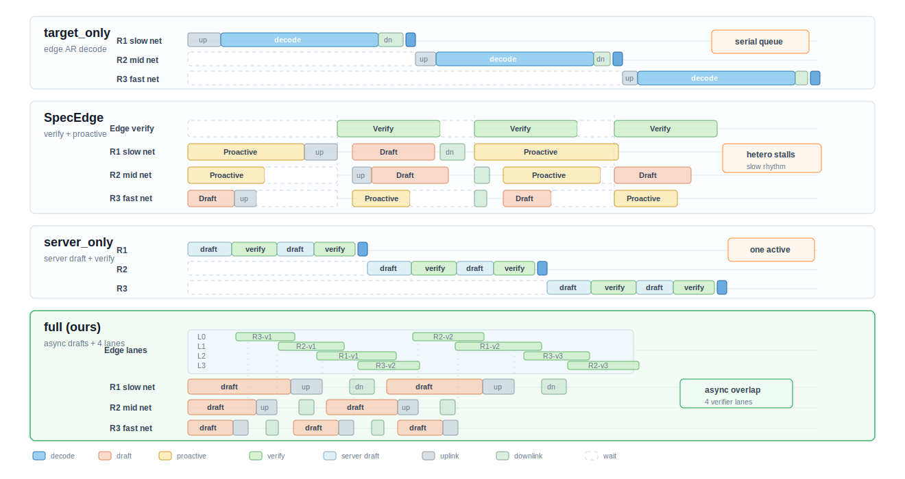

# 核心方法描述

本文档总结当前系统的核心方法，用于论文方法章节的初稿整理。文档重点描述研究动机、问题设定、方法框架和核心组件；相关工作暂不展开，待后续确定对比对象和引用后再补充。当前论文范围限定为 steady-state autoregressive decoding，不建模 prompt prefill、prompt 传输、TTFT 或 prefill/decode 资源竞争。

## 1. 动机

大语言模型在线服务通常受限于目标模型的自回归解码开销。推测解码通过较小的 drafter 预先生成候选 token，再由较大的 target model 执行验证，从而在保持 target greedy 语义一致性的前提下减少目标模型逐 token 解码次数。然而，传统推测解码大多假设推测过程发生在相对统一的计算环境中，或者将多个请求组织为同步 batch。该假设在端边协同场景下并不充分，因为用户侧设备的计算能力、网络 RTT、上下行带宽和可部署 drafter 规模往往高度异构。

在端边服务中，低端设备可能拥有较慢的 drafter 和较高的网络延迟，高端设备则可以更快地产生 draft token 并更早到达边缘。如果系统要求所有请求在同步 barrier 上对齐，快设备会被慢设备阻塞；如果系统只在边缘执行 target-only 解码，则端侧可用计算资源没有被利用；如果将 draft 和 verify 都放到服务器侧，又会重新把瓶颈集中到边缘服务器。因此，关键问题不只是如何提高单轮 acceptance rate，而是如何在异构设备、异构网络和边缘 target 资源之间形成有效流水线。

本文方法面向这一问题，采用“真实语义、解析时延、事件驱动”的端边推测解码框架。真实 drafter 和 target 模型负责生成候选 token、计算 acceptance、correction 和 bonus token；端侧设备、网络链路和边缘 verifier 的运行时间由解析模型给出；事件仿真器维护请求状态、设备队列、边缘验证队列和前缀一致性。请求进入仿真器时，端侧 drafter 和边缘 target 已分别建立该请求的 prefix KV cache；prompt 仍作为真实模型语义上下文使用，但其编码、传输和 KV 建立不进入虚拟时间。该设计将模型语义行为与硬件 wall-clock 噪声解耦，使方法能够在可控的异构设备模型下评估调度策略的 decode-only 收益。



图 1 展示了本文方法与若干基线的执行差异。`target_only` 将所有解码集中在边缘 target 上，容易形成串行队列；`server_only` 将 draft 和 verify 共址到服务器侧，但仍保留服务器侧串行路径；SpecEdge 风格的线性推测和 proactive continuation 能改善服务器流水线空泡，但在强异构设备和网络下仍可能受到同步验证节奏和慢路径影响。相比之下，本文方法允许端侧持续乐观起草，并允许边缘对同一请求的不同 speculative position 进行乱序验证，再按 target greedy 前缀顺序提交结果，从而压缩端侧 draft、网络传输和边缘 verify 之间的空泡。

## 2. 问题设定

系统包含一组异构 origin client devices 和一个部署 target model 的边缘服务器。每个请求在进入系统时固定绑定到一个 origin device，在整个生命周期内不迁移。每台 client device 固定部署一种 drafter，并以 segment 级 FIFO 队列串行执行本地 draft。边缘服务器部署较大的 target model，并提供若干 verifier lanes，用于验证从端侧上传的 draft segments。

对请求 \(r\)，系统维护其 prompt token 序列、已经提交给用户的输出前缀、边缘侧已经确认的 target greedy 前缀、当前 prefix version，以及仍处于 draft、传输、排队或验证中的 speculative segments。每个 segment 由起始位置、prefix version、draft token 序列和调度选择的 \(\gamma\) 构成。端侧 drafter 在当前真实提交前缀和仍未验证的乐观 draft 链之后继续生成候选 token；边缘 target 对候选 token 进行 greedy verification，并返回 accepted tokens、首个 correction 或全接受后的 bonus token。

系统时延由解析公式推进。端侧 draft 时延写作

```text
draft_ms = draft_startup_ms + 1000 * gamma / draft_token_rate_tok_s
```

其中 `draft_token_rate_tok_s` 由虚拟设备和 drafter profile 共同决定。边缘 verification 近似为 target model 的一次验证 forward，其时延写作

```text
verify_ms = verify_startup_ms + 1000 * B / target_only_token_rate_tok_s
```

其中 \(B\) 表示同一验证操作中的 segment 数。`full` 方法中每条 verifier lane 处理单个 segment，因此单段验证时 \(B=1\)；同步基线可形成 global batch。target-only 自回归生成时延写作

```text
target_only_ms = target_only_startup_ms + 1000 * output_tokens / target_only_token_rate_tok_s
```

通信只传输 token IDs，端边上下行均采用固定包头加 token payload 的模型：

```text
payload_bytes = packet_header_bytes + token_count * packet_token_bytes
network_ms = RTT_ms / 2 + payload_bytes * 8 / (bandwidth_mbps * 1000) + jitter_ms
```

这些公式只决定虚拟时间中的计算和通信开销。真实 Hugging Face 模型 forward 的 wall time 不计入系统时延；它只用于产生 token 语义和真实 acceptance 结果。

## 3. 方法框架

本文方法在代码中对应 `full`。其核心思想是在端侧和边缘之间建立持续异步的 speculative pipeline，并用前缀一致性机制保证最终输出严格等价于 target greedy decoding。方法由三个相互配合的组件组成：异步乐观起草、异构感知调度和前缀一致性控制。

在每个请求开始后，origin device 根据本地 FIFO 队列启动 draft。若该请求已有未验证 segment，device 不必等待边缘返回验证结果，而是沿当前乐观前缀链继续起草后续 segment。每个 segment 完成后通过网络上传到边缘。边缘收到 segment 后，并不要求它一定处于当前 frontier；只要 prefix version 仍有效，该 segment 可以被分配到空闲或预计最早完成的 verifier lane 进行提前验证。验证结果先缓存在边缘，只有当该 segment 的所有祖先 segment 已经按顺序确认后，系统才按 frontier 顺序解析、下发和提交。

这一流程使同一请求内部的多个 speculative positions 可以在边缘并行验证，但用户可见输出仍保持 target greedy 前缀顺序。若某个 segment 发生 rejection，系统提交 target correction，推进 prefix version，并使后续依赖旧前缀的乐观 segments 失效。若某个 segment 全接受并产生 bonus token，系统尝试将该 bonus 与下一 segment 的首 token 对齐；如果匹配，则裁掉下一 segment 的首 token 并重定位其 base position，从而保留后续已起草或已验证的工作。若无法安全重定位，则后续链失效并重新起草。

## 4. 核心组件一：异步乐观起草

异步乐观起草的目标是减少端侧 draft、网络传输和边缘 verify 之间的等待空泡。传统同步方案通常要求当前轮验证完成后才能启动下一轮 draft，或者要求多个请求在全局 batch barrier 上对齐。该策略在异构环境中会放大慢设备、慢网络或低 acceptance 请求造成的阻塞。本文方法取消固定窗口限制，使 request 可以沿乐观前缀持续向后起草，直到覆盖目标输出长度、请求完成，或前缀因 rejection 或 bonus 重定位而发生变化。

具体而言，系统为每个请求维护 `pending_segments` 和 `in_flight_segments`。端侧启动新 draft 前，会从已经提交的真实前缀出发，依次拼接仍处于活跃状态的 pending segments，形成用于下一段起草的乐观 prefix。新 segment 的 `base_pos` 等于真实提交位置加上当前乐观链长度。只要请求仍在运行、没有已完成但尚未提交的 verification result，并且乐观链未被前缀变化阻断，device 就可以继续生成新的 draft segment。

该策略的收益来自跨阶段重叠。低端设备的 draft 计算、慢网络的上行传输和边缘 verifier lane 的验证操作不再严格串行；快设备和快请求可以持续向边缘提供可验证工作，边缘 lane 也能更少处于空闲状态。其代价是可能产生 stale segments 和 wasted draft tokens，因为后续乐观 segment 可能在祖先 rejection 后失效。本文方法通过前缀一致性控制和 bonus 重定位降低这类浪费，使乐观执行带来的额外工作保持可控。

## 5. 核心组件二：异构感知调度

异构感知调度包含两个层面：动态选择 draft 长度 \(\gamma\)，以及为到达边缘的 segment 分配 verifier lane。前者决定每轮推测的激进程度，后者决定边缘验证资源如何服务来自不同设备和请求的 segment。

动态 \(\gamma\) 选择使用每个请求最近若干轮的真实 acceptance 历史估计接受率。若请求尚无历史观测，则使用该 drafter profile 的 acceptance prior 进行冷启动。对于候选集合 \([1, 2, 4, 6, 8]\)，系统过滤掉超过剩余输出长度的候选值，并估计该 \(\gamma\) 下的期望提交 token 数。设接受率估计为 \(\alpha\)，则期望输出 token 数可写为

```text
E[emitted | alpha, gamma] = (1 - alpha^(gamma + 1)) / (1 - alpha)
```

当 \(\alpha=1\) 时，该值退化为 \(\gamma+1\)，对应全部 draft token 被接受并获得一个 bonus token。系统随后用端侧 draft 时延、预计边缘排队时间、target verification 时延和上下行通信时延构成候选 \(\gamma\) 的代价，并最大化

```text
expected emitted tokens / predicted end-to-end segment latency
```

该目标使高 acceptance、快 device 或低网络延迟请求倾向于选择更大的 lookahead，而低 acceptance、慢 device 或高通信开销请求倾向于选择更保守的 \(\gamma\)。因此，方法并不假设固定 draft depth 对所有请求都合适，而是将 drafter 质量、设备速度、网络条件和边缘排队压力共同纳入决策。

边缘 lane 调度采用 least-finish 策略。对于一个待验证 segment，调度器估计每条 lane 当前 active work、排队 segment 的预测 verification 时延，以及该 segment 自身的 verification 时延，并选择预计完成时间最早的 lane。与 round-robin 相比，least-finish 更适合异构到达，因为它直接面向完成时间而不是平均分配请求数。该策略尤其适用于本文的 out-of-order verification：不同请求、甚至同一请求的后续 speculative positions，可以根据 lane 状态提前验证，而不必等待 frontier segment 完成后再进入边缘队列。

## 6. 核心组件三：前缀一致性控制

异步乐观执行必须解决一个核心正确性问题：后续 segment 可能基于尚未被 target 确认的前缀生成。若祖先 segment 被拒绝，则后续 segment 的 prefix 已经不再对应 target greedy 前缀；若祖先 segment 全接受并产生 bonus，则后续 segment 的 base position 可能可以向后移动一位并继续复用。本文方法通过 prefix version、frontier 顺序解析、stale 标记和 bonus 重定位共同维护一致性。

每个请求拥有单调递增的 `prefix_version`。新 segment 创建时记录当前版本；当 rejection 发生或 bonus 无法安全重定位时，请求的 prefix version 增加，所有旧版本的活跃 pending segments 被标记为 stale 或 discarded。边缘收到 segment 或准备启动验证时都会检查 prefix version；不匹配的 segment 不再参与有效验证。该机制将错误前缀的影响限制在单个请求内部，不会污染其他请求或全局 lane 状态。

边缘侧还维护 `edge_frontier_pos`，表示 target greedy 前缀已经确认到的位置。允许乱序 verify 并不意味着乱序提交。若一个后续 segment 已经完成验证，但其祖先 segment 尚未解析，该结果只保存在缓存中。当 frontier 前进到该 segment 的 `base_pos`，系统才解析 verification result，并按顺序产生下行结果。设备侧同样只按 committed position 提交已经到达的结果，因此用户可见输出始终与 target greedy decoding 一致。

bonus 重定位用于减少全接受后的无效工作。在标准推测解码中，若 draft segment 全部被 target 接受，target 会额外产生一个 bonus token。若该 bonus token 正好等于下一 segment 的首个 draft token，说明下一 segment 的第一个 token 已经被祖先 segment 的 bonus 覆盖。此时系统可以删除下一 segment 的首 token，将其 base position 后移一位，并把 bonus token 加入该 segment 的 prefix。若下一 segment 已经提前完成验证，系统还会同步转换缓存的 verification result：删除 emitted 序列中的首个 bonus，并将 accepted count 减一。若转换条件不满足，则后续乐观链失效并重新起草。

这一设计比保守回滚更细粒度。保守策略在前缀发生变化时直接丢弃后续链，逻辑简单但浪费较多；本文方法在能够证明语义等价时保留部分后续工作，在不能证明时才回滚。因此，它在保持 target greedy 正确性的同时，提高了乐观起草产生的有效工作比例。

## 7. 与基线的机制差异

`target_only` 是边缘自回归基线。decode-ready 请求由单个 target 服务资源完整生成输出，再将结果返回设备。该方法语义直接，但所有生成工作集中在边缘 target 上，请求完成时延和 TPOT/TBT 都容易受服务器串行解码影响。

`sync_batch_sd` 保留异构 drafter 和动态 \(\gamma\)，但使用全局同步 batch verify。它可以利用端侧 draft，但需要等待 batch 条件或 timeout，因而在设备和网络异构时可能产生 barrier waiting。

`SpecEdge` 是机制级 baseline，包含线性 speculative draft、server batch validation、proactive 线性 continuation 和 pipeline-aware scheduling。当前实现不移植 token tree，而是用线性 draft depth 近似其主要流水线机制。该方法可以通过 proactive continuation 降低服务器空闲，但在异构端边场景下仍可能受到同步验证节奏、batch waiting 和 proactive waste 影响。

`server_only` 是 SpecEdge server-only 的近似基线。在 decode-only 口径下，它不统计请求级 prompt 上传，只承担最终输出下载，也不做 segment 级端边往返；服务器侧使用固定 medium drafter 交替执行 draft 和 target verify，并按单 active request 语义串行处理请求。该方法减少网络往返，但重新把 draft 和 verify 压力集中到服务器侧。

本文 `full` 方法与上述基线的关键差异在于，它同时利用端侧异构 draft 能力和边缘多 lane verification 能力，并通过前缀一致性控制支持同一请求内部的多位置并行验证。方法收益不依赖于 acceptance rate 必然高于基线；即使 acceptance 相近或略低，异步流水线、lane 并行和局部保留机制仍可能通过降低等待空泡和提高资源重叠度改善 decode-only 完成时延。

## 8. 论文写作中的可强调点

本文方法的第一点创新是将端侧持续乐观起草扩展到异构端边场景，使端侧 draft、网络传输和边缘 verify 能够跨请求、跨 segment 重叠执行。第二点创新是以预计完成时间和动态 acceptance 估计为核心进行调度，而不是使用固定 lookahead 或简单 round-robin lane 分配。第三点创新是前缀一致性控制，它允许乱序验证但保持顺序提交，并通过 bonus 重定位保留可证明仍然有效的后续工作。

从论文叙事角度，方法章节可以围绕一个主张展开：端边推测解码的瓶颈并不只是 target forward 的次数，而是异构端侧 draft、网络往返和边缘验证之间的流水线协调。本文方法通过异步化、异构感知调度和一致性保持，将传统推测解码中的“单轮接受率优化”扩展为“解码流水线效率优化”。

## 9. 相关工作占位

相关工作将在后续版本中补充。建议至少覆盖四类文献：标准 speculative decoding，端边协同 LLM serving，SpecEdge 或相近的边缘辅助推测服务，异步流水线与异构调度。补充相关工作时，应避免只罗列已有方法，而应明确指出它们通常没有同时处理端侧 drafter 异构、网络异构、同请求多位置乱序 verify，以及前缀一致性下的局部工作保留。
